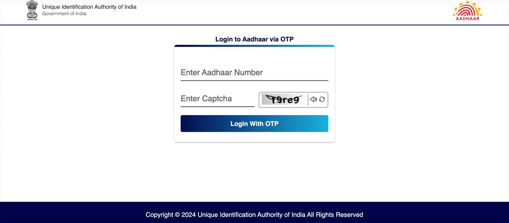
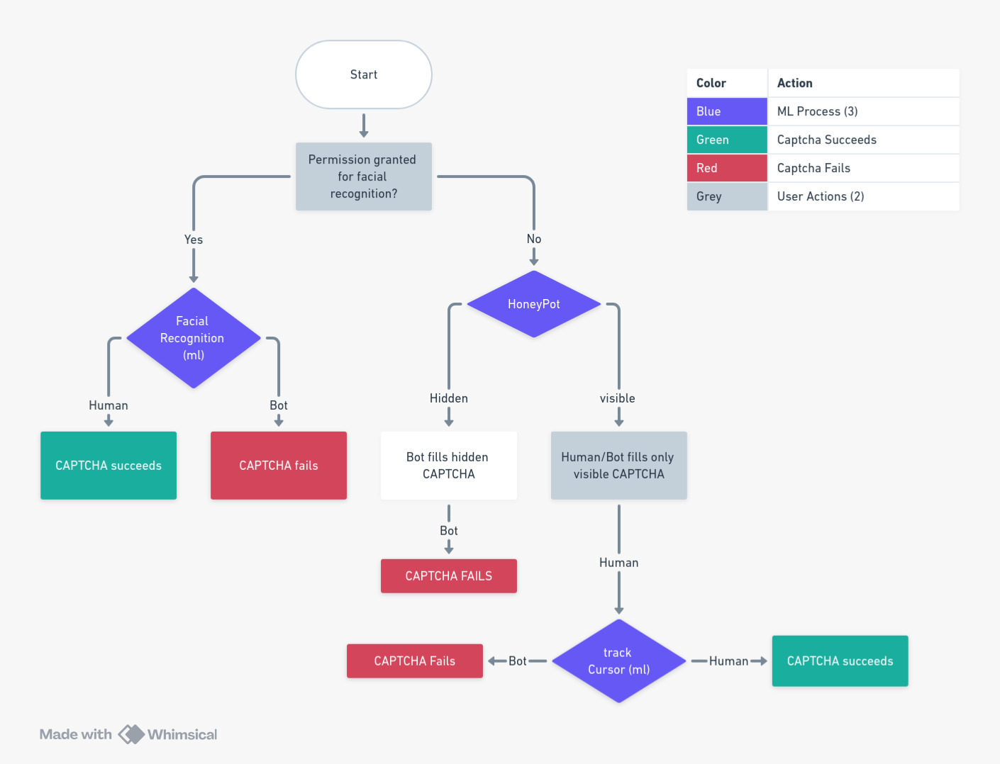
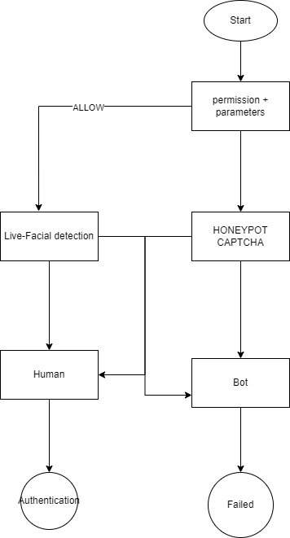

# PS-ID: 1672
## PS-Title: Develop a ML Model based solution to refine CAPTCHA.

## Description:
1. Background. UIDAI has multiple portals on the Internetfor resident engagement and back office operations. These portals are protected with CAPTCHA for denial of service- related attacks. UIDAI believes that CAPTCHA is a barrier to smooth resident engagement with the aadhaar portals and therefore intends to remove it soon. Instead of active CAPTCHA, UIDAI is looking for a passive solution that can differentiate between a bot and a human operator. 
2. Problem Description. As part of the challenge, participating teams to develop a solution, mostly following a passive approach through collection of environmental parameters and using AI/ML to analyze it in the backend to differentiate between bot and human-being. The passive solution may capture environmental details through the browser context and analyze the same with the help of ML models deployed in the backend. This solution, once accepted would be used by the UIDAI to protect all backend APIs from DoS/DDoS based vulnerabilities.
The solution must meet the following requirements:- 
3. The proposed solution must meet the following objectives. 
+ Feature Requirements. The solution must define the list of environmental parameters that need to be captured to differentiate between a bot and a human being. If passive parameter analysis is unable to differentiate, then the user may be asked to do a few minimal interactions with the portal. User experience is important to UIDAI and hence human interaction is to be limited. 
+ Frontend code to capture environmental or human interaction data must be compliant with the javascript framework. Participating teams may choose to use any framework like React/TypeScript/Flutter to demonstrate the solution. 
+ As part of the solution, the required backend ML model to analyze the front- end capture of environment parameters or human interaction data must be developed to demonstrate the solution. The ML model must be pluggable so that it can be integrated with the UIDAI application stack to protect the APIs. 
+ The solution must adhere to the core privacy policies of UIDAI. 

### Expected Solution:
The solution must be complete with both frontend and backend design, corresponding code and ML model to demonstrate the solution.

## Official [Login Page](https://tathya.uidai.gov.in/access/login?role=resident) of UIDAI

## Solution:

### First Flowchart:

### Refined Flowchart:

