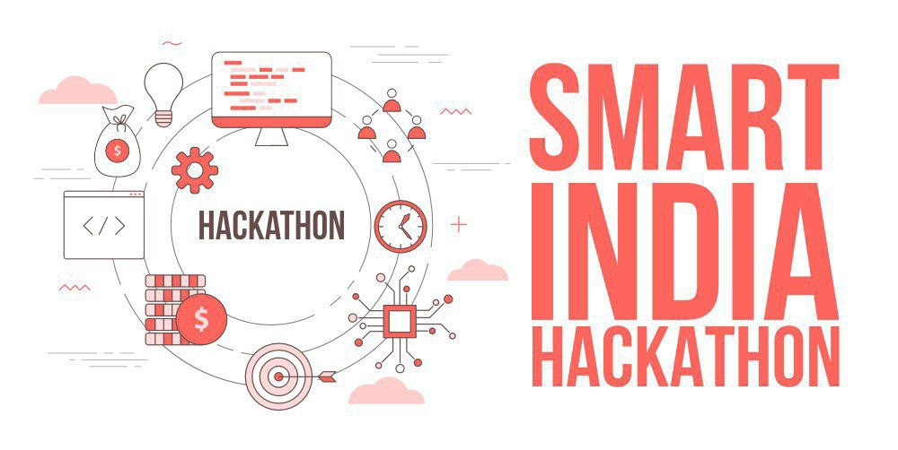

# ZEROV2: SIH 2024 Journey

Welcome to the official repository of **ZEROV2** for the **Smart India Hackathon (SIH) 2024**. This repository serves as a comprehensive walkthrough of our entire journey in the hackathon, covering everything from brainstorming and research to development and final submissions.

## Introduction
The **ZEROV2** was formed to address real-world challenges as part of the **Smart India Hackathon 2024**. Our journey began with deep research into various problem statements and culminated in a robust, innovative solution that aims to make a real difference.

This repository details every step of our journey, from initial brainstorming sessions to project deployment and feedback.

> NOTE: Put Your Problem-Statement file in **Problem-Documentation [Candidate-Problems]** Folder

## Visit [Documentation](https://github.com/akash2061/SIH-2024/blob/main/Documentation/Captcha.md)

### Contributors:

+ **SuriBaba**              
+ **Mahipal Singh Jhala**   
+ **Pratibha Singh**        
+ **Raghavendea Baheti**    
+ **Toheed Akhtar**         
+ **Akash Soni**            
